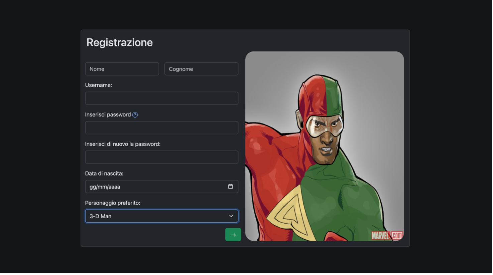
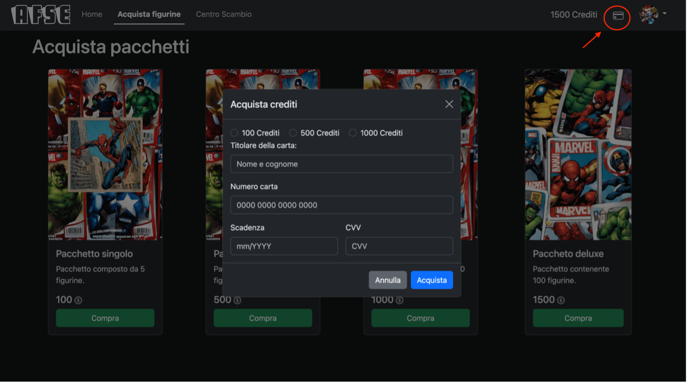
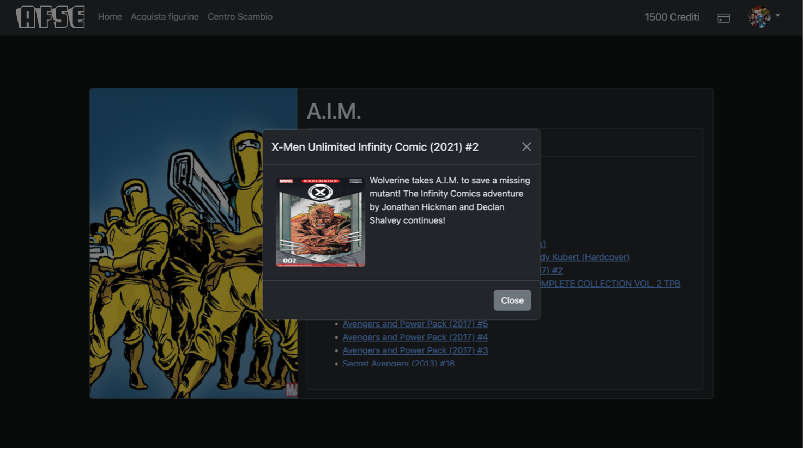

# Album Figurine Supereroi

Progetto universitario per il corso di AWC (Applicazioni Web e Cloud).

Il progetto si pone l’obiettivo di sviluppare l’applicazione web Album delle Figurine dei Super Eroi (AFSE), un sito di gestione di figurine elettroniche di super eroi.

Il progetto è sviluppato interamente lato client (inclusa l'autenticazione, solo a fini didattici) utilizzando HTML5, CSS3 e JavaScript, avvalendosi dell'utilizzo dell'[API di Marvel](https://developer.marvel.com/docs) per il contenuto dinamico.

<table>
<tr>
<td>

</td>

<td>

</td>
</tr>

<tr>
<td>

</td>

<td>

</td>
</tr>
</table>

La specifica completa del progetto può essere vista [qui](./docs/AWC_project_22_23.pdf), mentre il report finale [qui](./docs/AFSE_documentazione.pdf).

## Executing locally

Il progetto richiede un'API key valida, ottenibile dal Marvel Developer Portal, da posizionare nel file [script/marvel.js](./script/marvel.js)
